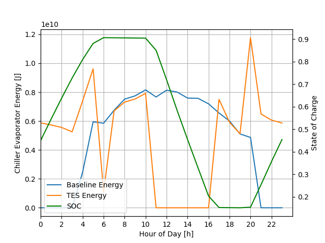
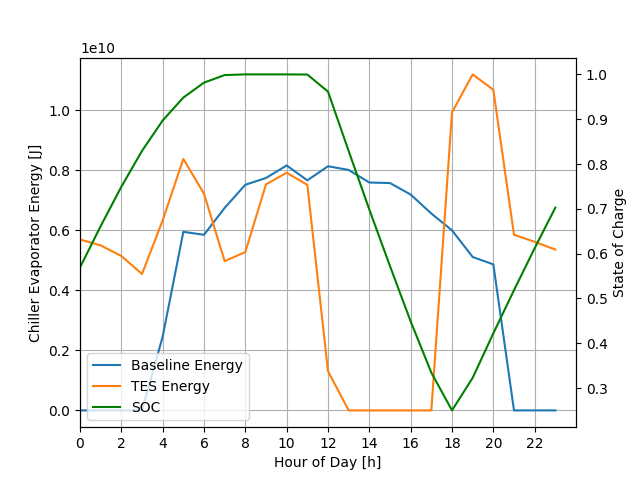

# Simple Control Demonstration

## Overview

A simple control demonstration has been developed that shows how controls can be implemented that change the behaviour of the TES behavior. The `pytank` plugin operates off a mode schedule, so the key operation is to override that schedule. This is done in two parts:

 - A measure named `AddDemoNoonToSix` is used to set up the plugin and connect it to the model using the appropriate input objects.
 - A Python plugin named `demo_noon_to_six.py` actuates the schedule and controls the TES system.

 For maximum simplicity, the demonstration pluging overrides the schedule to discharge between noon and 6PM every day that it is active.

 ## Measure

The measure has a number of things it must do. It takes two arguments:

 - TES type: the plugin only works for the `pytank` plugin, but future development may extend this. This argument lets the measure know what changes it needs to make.
 - Python plugin directory: this is an existing directory that the measure can files to and is in the Python plugin search path list.

Currently, the Python plugin directory is set to the run directory where OpenStudio is writing files. This directory is added to the Python search path using another measure. This functionality may be integrated into the measure directly in the future. This directory is needed so the following file can be written out:

```python
# case_details.py
#
# This file is generated code, modify at your own risk.
from enum import Enum

class Mode(Enum):
    CHARGE = 1
    IDLE = 0
    DISCHARGE = -1

MODE_SCHEDULE_TYPE = 'Schedule:Compact'
MODE_SCHEDULE_NAME = 'Charge Sch'
```

This tells the Python plugin where to find the schedule and how to handle to modes of the TES. For a different TES system, these details would be different. The other thing that the measure does is adds a `PythonPlugin_Instance` that points at the plugin in `demo_noon_to_six.py`.

## Plugin File

The Python plugin file is as follows (with the license details removed):

```python
# demo_noon_to_six.py
#
from pyenergyplus.plugin import EnergyPlusPlugin
from case_details import MODE_SCHEDULE_TYPE, MODE_SCHEDULE_NAME, Mode

class NoonToSix(EnergyPlusPlugin):

    def actuate(self, state, x):
        self.api.exchange.set_actuator_value(state, self.data['mode_schedule'], x)

    def on_begin_zone_timestep_before_init_heat_balance(self, state) -> int:
        if 'mode_schedule' not in self.data:
            self.data['mode_schedule'] = self.api.exchange.get_actuator_handle(
                state, MODE_SCHEDULE_TYPE, "Schedule Value", MODE_SCHEDULE_NAME
            )
            if self.data['mode_schedule'] == -1:
                self.api.runtime.issue_severe(state, "Could not get handle to TES mode schedule")
                return 1

        hour = self.api.exchange.hour(state)
        if hour < 12:
            self.actuate(state, Mode.CHARGE.value)
        elif 12 <= hour < 18:
            self.actuate(state, Mode.DISCHARGE.value)
        else:
            self.actuate(state, Mode.CHARGE.value)
        return 0
```

It first imports the necessary features from the EnergyPlus plugin framework, then the case details that tell it where to do things. The code itself is quite simple. The `actuate` method does the changing, and the `on_begin_timestep_before_predictor` figures out what needs to be done. Note that the plugin simply requests the time from EnergyPlus and then acts upon it.

## Results
The large office model for climate zone 5A with the defaults is used to demonstrate the plugin. The default results, which discharges between 11AM and 5PM is shown in the following figure:



Note that the state of charge drops off at 11AM, stops at zero charge around 5PM, then is idle until after 8PM. The plugin-controlled results look a little bit different:



Note that the state of charge now drops at noon and at 6PM there is an abrupt transition from discharging to charging. This difference is because the plugin is either charging or discharging. The interested reader should be able to modify the plugin logic to be idle for an hour or two after discharge is complete.

## Summary

The demonstration plugin is described and the two parts (a measure and a plugin file) are explained. The measure sets up the plugin and writes out a file that includes directions for the plugin. The plugin file then takes that information and controls the TES system. This demonstration is very simple and only bases what it does on the hour of day, but additional signals are easy to add. Any output variable found in the RDD can be utilized along with the other parts of the plugin feature that are not shown here.
